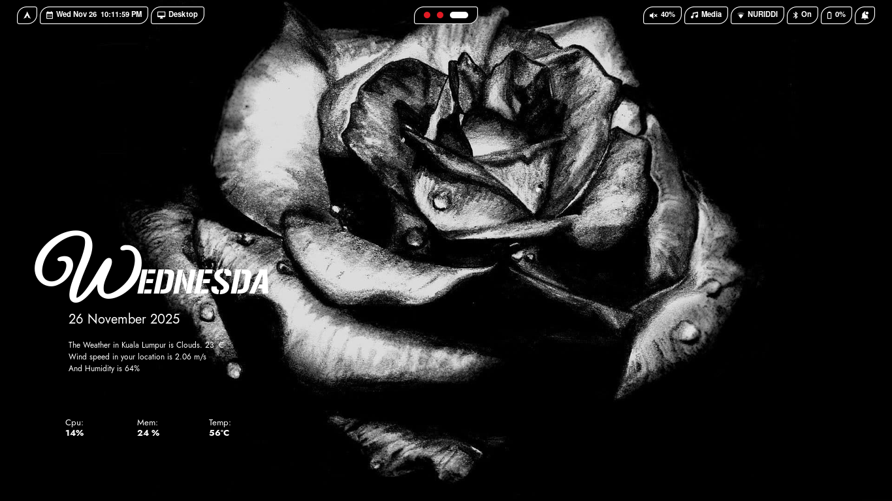
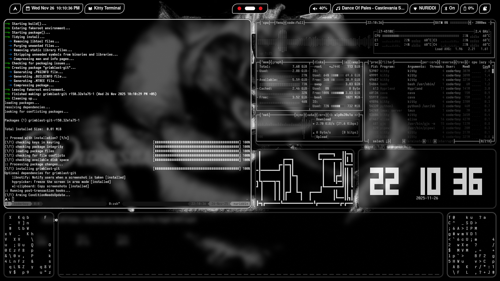
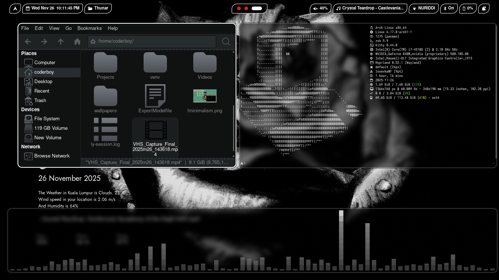

# ❄️ Arktik Light Dotfiles v0.01

**Author:** Abduraxmonov Nuriddin (**SourceCodeSorcerer**)

---

## 🇺🇸 English Version

Welcome to the **Arktik Light Dotfiles**! Thank you for the overwhelming interest in my setup. This repository contains all the configuration files (dotfiles) for my "Arktik Light" rice, offering a clean, light, and customizable Arctic-inspired aesthetic built primarily around the **Hyprland** Wayland compositor.

### ✨ Features Overview

This package includes configurations for several key tools:

| Component | Description | Configuration Folder |
| :--- | :--- | :--- |
| **Compositor** | Hyprland (Tiling Wayland Compositor) | `hyprland` |
| **Bar/Panel** | Hyprpanel | `hyprpanel` |
| **Terminal** | Kitty | `kitty` |
| **App Launcher** | Rofi | `rofi` |
| **Shell** | Zsh with Oh My Zsh | `.zshrc`, `.oh-my-zsh` |
| **Monitoring** | Conky System Monitor | `conky` |
| **Theming** | Custom GTK Theme and Icons | `gtk-theme`, `icons` |
| **Display Manager** | Ly | `ly` |
| **Other** | Wallpapers, GRUB, tmux, mkinitpcio | `wallpapers`, `grub`, `.tmux.conf` |

### 📸 Screenshots

Here is a preview of the setup:

| Screenshot 1 | Screenshot 2 | Screenshot 3 |
| :---: | :---: | :---: |
|  |  |  |

---

### 🛠️ Installation Guide

This method downloads the compressed dotfiles archive directly and runs the included script.

#### Prerequisites

Ensure you have the following basic tools installed:
* **`wget`** (or `curl`) to download the file.
* **`unzip`** to extract the archive.

#### Step-by-Step Guide

0.  **Install needed tools**
    ```bash
    sudo pacman -S zip unzip wget git
    ```

1.  **Download the Dotfiles Archive:**
    ```bash
    wget https://github.com/SourceCodeSorcererNuri/monochrome-dark-v0.01/raw/refs/heads/main/monochrome-dark-dotfiles.zip
    ```

2.  **Unzip the Archive and Navigate:**
    ```bash
    unzip monochrome-dark-dotfiles.zip
    cd monochrome-dark-dotfiles
    ```

3.  **Run the Installer Script:**
    ```bash
    ./installer.sh
    ```
    > **Warning:** Always review the contents of `./installer.sh` before running it to understand the changes it will make to your system. And it this dotfiles for nvidia gpu PCs / laptops please edit mkinitpcio.conf and grub file in order to use amd or intel gpu

---
---

## 🇺🇿 O'zbekcha Talqini (Uzbek Version)

**Arktik Light Dotfiles**'ga xush kelibsiz! Mening sozlamalarimga (rice) bo'lgan qiziqishlaringiz uchun katta rahmat. Ushbu omborxona (repository) mening "Arktik Light" setupim uchun barcha konfiguratsiya fayllarini (`dotfiles`) o'z ichiga oladi. U asosan **Hyprland** Wayland kompozitori atrofida qurilgan bo'lib, toza, yorug' va Arctic-uslubidagi estetikani taklif etadi.

### ✨ Xususiyatlarga Umumiy Nazar

Ushbu paket bir nechta asosiy vositalar uchun konfiguratsiyalarni o'z ichiga oladi:

| Komponent (Component) | Tavsif (Description) | Konfiguratsiya Papkasi |
| :--- | :--- | :--- |
| **Kompozitor** | Hyprland (Tiling Wayland Compositor) | `hyprland` |
| **Bar/Panel** | Hyprpanel | `hyprpanel` |
| **Terminal** | Kitty | `kitty` |
| **Ilova Ishga Tushirgich** | Rofi | `rofi` |
| **Qobiq (Shell)** | Zsh (Oh My Zsh bilan) | `.zshrc`, `.oh-my-zsh` |
| **Monitoring** | Conky Tizim Monitori | `conky` |
| **Mavzulashtirish** | Maxsus GTK Mavzusi va Ikonkalar | `gtk-theme`, `icons` |
| **Displey Menejeri** | Ly | `ly` |
| **Boshqalar** | Fon rasmlari, GRUB, tmux, mkinitpcio | `wallpapers`, `grub`, `.tmux.conf` |

### 📸 Skrinshotlar

Setupning ko'rinishi:

| Skrinshot 1 | Skrinshot 2 | Skrinshot 3 |
| :---: | :---: | :---: |
|  |  |  |

---

### 🛠️ O'rnatish Qo'llanmasi

Ushbu usul dotfiles arxivini to'g'ridan-to'g'ri yuklab oladi va o'rnatuvchi skriptni ishga tushiradi.

#### Oldindan Talablar (Prerequisites)

Sizda quyidagi asosiy vositalar o'rnatilganligiga ishonch hosil qiling:
* **`wget`** (yoki `curl` `sudo pacman -S zip unzip wget` dan foydalanib kerakli asboblarni yuklab oling) faylni yuklab olish uchun.
* **`unzip`** arxivni ochish uchun.

#### Bosqichma-Bosqich Qo'llanma

0.  **Kerakli dasturlarni o'rnating:**
    ```bash
    sudo pacman -S zip unzip wget git
    ```

1.  **Dotfiles Arxivini Yuklab Olish:**
    ```bash
    wget https://github.com/SourceCodeSorcererNuri/monochrome-dark-v0.01/raw/refs/heads/main/monochrome-dark-dotfiles.zip
    ```

2.  **Arxivni Ochish va Papkaga O'tish:**
    ```bash
    unzip monochrome-dark-dotfiles.zip
    cd monochrome-dark-dotfiles
    ```

3.  **O'rnatuvchi Skriptni Ishga Tushirish:**
    ```bash
    ./installer.sh
    ```
    > **Ogohlantirish:** Tizimingizga kiritiladigan o'zgarishlarni tushunish uchun `./installer.sh` faylining ichidagi ma'lumotlarni ishga tushirishdan oldin har doim ko'rib chiqing. Va bu nvidia grafik kartasi bor noutbuk va kompyuterlarga tavsiya etiladi siz mkinitpcio.conf va grub fayllarini to'girlab olishinngiz kerak bo'ladi agar sizda amd cpu/gpu bo'lsa
