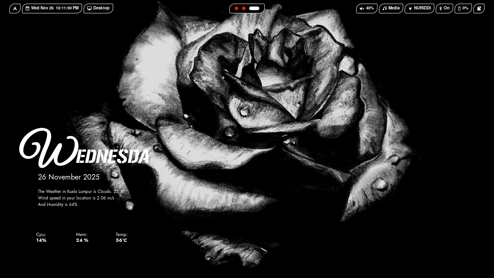
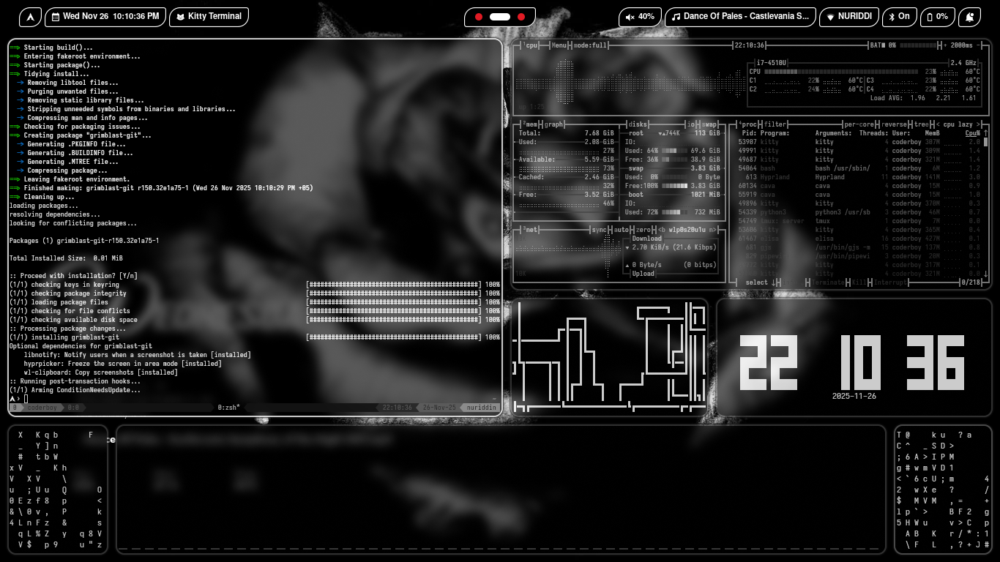
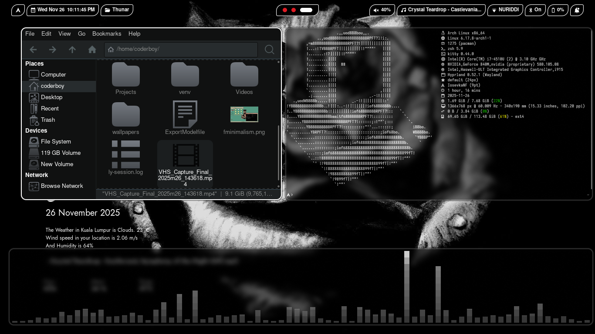

# 🦇 Monochrome Dark Dotfiles v0.01

**Author:** Abduraxmonov Nuriddin (**SourceCodeSorcerer**)

---

## 🇺🇸 English Version

Welcome to the **Monochrome Dark Dotfiles**! Thank you for the overwhelming interest in my setup. This repository contains all the configuration files (dotfiles) for my "Monochrome Dark" rice, offering a clean, light, and customizable Arctic-inspired aesthetic built primarily around the **Hyprland** Wayland compositor.

### ✨ Features Overview

This package includes configurations for several key tools:

| Component | Description | Configuration Folder |
| :--- | :--- | :--- |
| **Compositor** | Hyprland (Tiling Wayland Compositor) | `hyprland` |
| **Bar/Panel** | Hyprpanel | `hyprpanel` |
| **Terminal** | Kitty | `kitty` |
| **App Launcher** | Rofi | `rofi` |
| **Shell** | Zsh with Oh My Zsh | `.zshrc`, `.oh-my-zsh` |
| **Monitoring** | Conky System Monitor | `conky` |
| **Theming** | Custom GTK Theme and Icons | `gtk-theme`, `icons` |
| **Display Manager** | Ly | `ly` |
| **Other** | Wallpapers, GRUB, tmux, mkinitpcio | `wallpapers`, `grub`, `.tmux.conf` |

### 📸 Screenshots

Here is a preview of the setup:

| Screenshot 1 | Screenshot 2 | Screenshot 3 |
| :---: | :---: | :---: |
|  |  |  |

---

### 🛠️ Installation Guide

This method downloads the compressed dotfiles archive directly and runs the included script.

#### Prerequisites

Ensure you have the following basic tools installed:
* **`wget`** (or `curl`) to download the file.
* **`unzip`** to extract the archive.

#### Step-by-Step Guide

0.  **Install needed tools**
    ```bash
    sudo pacman -S zip unzip wget git
    ```

1.  **Download the Dotfiles Archive:**
    ```bash
    wget https://github.com/SourceCodeSorcererNuri/monochrome-dark-v0.01/raw/refs/heads/main/monochrome-dark-dotfiles.zip
    ```

2.  **Unzip the Archive and Navigate:**
    ```bash
    unzip monochrome-dark-dotfiles.zip
    cd monochrome-dark-dotfiles
    ```

3.  **Run the Installer Script:**
    ```bash
    ./installer.sh
    ```

#### Shortcuts

| Shortcuts | Task | Description |
| :--- | :--- | :--- |
| `Alt + Enter` | Opens a new terminal window | Uses kitty |
| `Alt + Shift + Q` | Closes an active window | No description needed, it just closes the window you focused |
| `Alt + Shift + E` | Quits from hyprland | do this if you want to switch between your other DEs (Desktop Environment) or WMs (window managers) |
| `Alt + Shift + W` | Opens waypaper app | If you want to change your wallpaper simply put your images to *wallpapers* folder and click refresh on the app it should automaticly see it after that just click to your wallpaper |
| `Alt + E` | Opens file explorer | uses Thunar file manager which is very lightweight |
| `Alt + Shift + P` | Screenshot | if you want to take screenshot just press it and select the place that you want to screenshot and it will appear in Pictures/Screenshots folder (it uses grimblast) |
| `Alt + Shift + F` | Fullscreen | makes the focused window fullscreen press it again to exit from fullscreen |
| `Alt + Shift + N` | Opens firefox in private mode | in this mode your history and cookies won't be saved perfect for quick searches |
| `Alt + D` | Opens Application Menu | it uses rofi |
| `Alt + 1-9` | Change workspace between 1 and 9 | this is switches between your virtual workspaces |
| `Alt + Shift + 1-9` | Moves mainly focused window to workspaces between 1 and 9 | default hyprland shortcut |
| `Alt + ArrowKeys` | Moves focus to other windows in same workspace | default hyprland shortcut |
| `Alt + Shift + ArrowKeys` | Moves focused window around | if you want to change your windows positions use this |
| `Alt + Shift + S` | Moves focused window to magic workspace | it is like a secret workspace in hyprland |
| `Alt + S` | Goes to magic workspace | to see your hidden / minimized apps |
| `Alt + R` | Resize mode | if you ever used i3wm you know this shortcut but it works a little different in hyprland after you switch resize mode use `ArrowKeys` to resize however you want and press `Return` or `Enter` to exit from resize mode |
| `Alt + LMB` | Move around active window | no need for description it will just moves around active window but with left mouse button |
| `Alt + RMB` | Resize active window | it works just like *Resize mode* but with Right mouse button |


*Final*:
    1. Use: `reboot` command at the end to reboot your PC 
    2. After that make sure you will select the Hyprland from Ly login screen
    3. Enjoy your new monochrome setup

    > **Note:** this updated script will automaticly detects your gpu and installs correct drivers for it enjoy!
    > **Note:** If you see any errors and installer script stops randomly do nothing but run installer script again.

Subscribe on youtube: https://youtube.com/@Source_Code_Sorcerer
Follow on instagram: https://instagram.com/source_code_sorcerer 
Follow on github: https://github.com/SourceCodeSorcererNuri
Chat on telegram: https://t.me/SourceCodeSorcerer
---
---

## 🇺🇿 O'zbekcha Talqini (Uzbek Version)

**Monochrome Dark Dotfiles**'ga xush kelibsiz! Mening sozlamalarimga (rice) bo'lgan qiziqishlaringiz uchun katta rahmat. Ushbu omborxona (repository) mening "Monochrome Dark" setupim uchun barcha konfiguratsiya fayllarini (`dotfiles`) o'z ichiga oladi. U asosan **Hyprland** Wayland kompozitori atrofida qurilgan bo'lib, toza, yorug' va Arctic-uslubidagi estetikani taklif etadi.

### ✨ Xususiyatlarga Umumiy Nazar

Ushbu paket bir nechta asosiy vositalar uchun konfiguratsiyalarni o'z ichiga oladi:

| Komponent (Component) | Tavsif (Description) | Konfiguratsiya Papkasi |
| :--- | :--- | :--- |
| **Kompozitor** | Hyprland (Tiling Wayland Compositor) | `hyprland` |
| **Bar/Panel** | Hyprpanel | `hyprpanel` |
| **Terminal** | Kitty | `kitty` |
| **Ilova Ishga Tushirgich** | Rofi | `rofi` |
| **Qobiq (Shell)** | Zsh (Oh My Zsh bilan) | `.zshrc`, `.oh-my-zsh` |
| **Monitoring** | Conky Tizim Monitori | `conky` |
| **Mavzulashtirish** | Maxsus GTK Mavzusi va Ikonkalar | `gtk-theme`, `icons` |
| **Displey Menejeri** | Ly | `ly` |
| **Boshqalar** | Fon rasmlari, GRUB, tmux, mkinitpcio | `wallpapers`, `grub`, `.tmux.conf` |

### 📸 Skrinshotlar

Setupning ko'rinishi:

| Skrinshot 1 | Skrinshot 2 | Skrinshot 3 |
| :---: | :---: | :---: |
|  |  |  |

---

### 🛠️ O'rnatish Qo'llanmasi

Ushbu usul dotfiles arxivini to'g'ridan-to'g'ri yuklab oladi va o'rnatuvchi skriptni ishga tushiradi.

#### Oldindan Talablar (Prerequisites)

Sizda quyidagi asosiy vositalar o'rnatilganligiga ishonch hosil qiling:
* **`wget`** (yoki `curl`) faylni yuklab olish uchun.
* **`unzip`** arxivni ochish uchun.

#### Bosqichma-Bosqich Qo'llanma

0.  **Kerakli dasturlarni o'rnating:**
    ```bash
    sudo pacman -S zip unzip wget git
    ```

1.  **Dotfiles Arxivini Yuklab Olish:**
    ```bash
    wget https://github.com/SourceCodeSorcererNuri/monochrome-dark-v0.01/raw/refs/heads/main/monochrome-dark-dotfiles.zip
    ```

2.  **Arxivni Ochish va Papkaga O'tish:**
    ```bash
    unzip monochrome-dark-dotfiles.zip
    cd monochrome-dark-dotfiles
    ```

3.  **O'rnatuvchi Skriptni Ishga Tushirish:**
    ```bash
    ./installer.sh
    ```

#### Shortcutlar

| Shortcut | Vazifa | Ma'lumot |
| :--- | :--- | :--- |
| `Alt + Enter` | Yangi terminal oynasini ochish | kitty terminaldan foydalanadi |
| `Alt + Shift + Q` | Aktiv oynani yopadi | Ma'lumot shart emas, shunchaki qaysi oyna aktiv bo'lsa o'shani yopadi |
| `Alt + Shift + E` | Hyprlanddan chiqib ketish | Agar hyprlanddan chiqib boshqa biron-bir WM (Window manager) yoki DE (Desktop Environment)dan foydalanmoqchi bo'lsangiz |
| `Alt + Shift + W` | Waypaper Dasturini ochadi | Agarda siz shaxsiy Oboyingizni ishlatishni hohlasangiz shunchaki Oboyingizni *wallpapers* papkasiga o'tkazing hamda waypaper dasturida `refresh` tugmasini bosing va Oboyingizni tanlang |
| `Alt + E` | Fayl menejirini ochish | Thunar fayl menejiridan foydalanilgan va judaham yengil |
| `Alt + Shift + P` | Skrinshot | Agar skrinshot olishni hohlasangiz bu shortcutdan foydalaning va kerak joyni belgilang. Skrinshotlar `Pictures/Screenshots` papkasida bo'ladi |
| `Alt + Shift + F` | To'liq ekran rejimi | Aktiv oynani to'liq ekranga o'tkazadi. To'liq ekrandan chiqarish uchun bu shortcutdan qayta foydalaning. |
| `Alt + Shift + N` | Private rejimda Firefoxni ochish | Bu rejimda sizning qidiruv tarixingiz va cookie fayllaringiz saqlab qolinmaydi tezkor qidiruvlar uchun ayni-muddao |
| `Alt + D` | Dasturlar menusini ochish  | rofidan foydalanilgan |
| `Alt + 1-9` | 1dan 9gacha bo'lgan ish joylari orasida yurish | hyprlanddagi virtual ish joylarni almashtirishda ishlatasiz |
| `Alt + Shift + 1-9` | Aktiv oynani ish joylari bo'ylab joylashtirish | Hyprland zavod sozlamasi. Agar biron-bir oynani boshqa ish joyiga ko'chirmoqchi bo'lsangiz bundan foydalaning |
| `Alt + ArrowKeys` | Ish joyidagi oynalar orasida aktivni almashitirish | Hyprland zavod sozlamasi. Boshqa oynani aktiv qilishda foydalanasiz. |
| `Alt + Shift + ArrowKeys` | Aktiv oynani joyini almashtiradi | Agar biron bir oyna bilan aktiv oynaning joyini almashtirmoqchi bo'lsangiz bundan foydalaning |
| `Alt + Shift + S` | Aktiv oynani magic ish joyiga ko'chiradi | bu hyprlandda sirli ish joyi va odamlar u yerga ko'pincha musiqa pleyerini yoki shunga o'xshagan narsani o'tkazib qo'yish mumkin |
| `Alt + S` | Magic ish joyiga o'tish | Agar o'sha yashirilgan oynalarni ko'rmoqchi bo'lsangiz |
| `Alt + R` | Hajmni to'g'irlash rejimi | Agar siz i3wm dan foydalangan bo'lsangiz bu haqida bilasiz. Siz aktiv oynani hajmini `ArrowKeys` orqali to'g'irlaysiz va bundan so'ng `return` yoki `enter` tugmasini bosib bu rejimdan chiqasiz. *Eslatma*: agar bu rejimdan chiqmasangiz boshqa shortcutlardan foydalana olmaysiz. |
| `Alt + LMB` | Aktiv Oynani joyini o'zgartish huddi `Alt + Shift + ArrowKeys` kabi | Ma'lumot shart emas bitta farqi bu sichqonchaning chap tugmasidan foydalanib bajariladi |
| `Alt + RMB` | Aktiv Oynani hajmini *Hajmni to'g'irlash rejimi*ga o'tmasdan turib to'g'irlash | Ma'lumot shart emas bitta farqi bu sichqonchaning o'ng tugmasi orqali bajariladi |


*Final*:
    1. installer.sh *TAYYOR!* degan yozuvni ko'rsatgandan so'ng `reboot` buyrug'idan foydalaning va kompyuterni o'chirib yoqing.
    2. Kompyuter yongandan so'ng LY login menyusida Hyprland tanlanganiga ishonch hosil qiling va uni tanlang.
    3. Yang MonoChrome temasidan bahramand bo'ling.

    > **Note:** Bu yangilangan kod avtomatik ravishda sizning Grafik kartangizga mos drayverlarni o'rnatib beradi va ishlashga tayyor holatga olib keladi!
    > **Note:** Agar qanaqadir error ko'rsangiz yoki kod sizga *TAYYOR!* xabarini ko'rsatmay chiqib ketsa qo'rqmang! shunchaki `installer.sh` faylini qayta ishga tushuring.

Youtubeda obuna bo'ling: https://youtube.com/@Source_Code_Sorcerer
Instagramda follow bosing: https://instagram.com/source_code_sorcerer 
Githubda follow bosing: https://github.com/SourceCodeSorcererNuri
Telegramdan yozing: https://t.me/SourceCodeSorcerer
